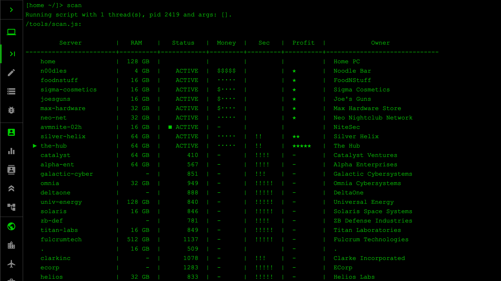
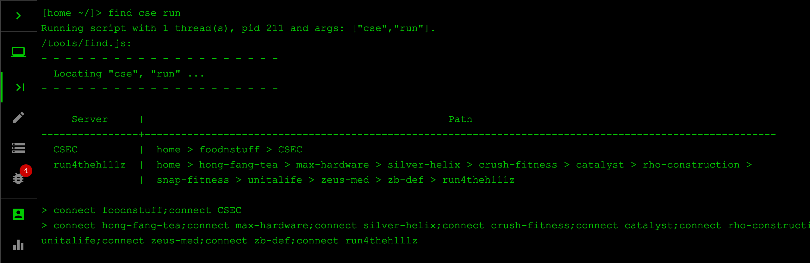
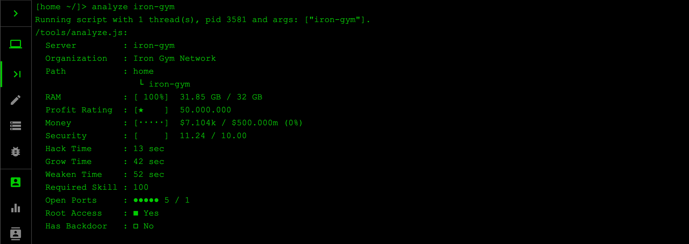
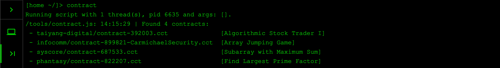
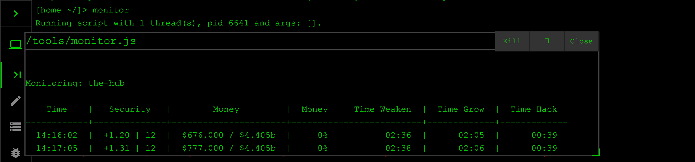
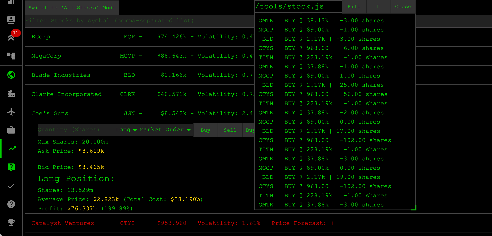
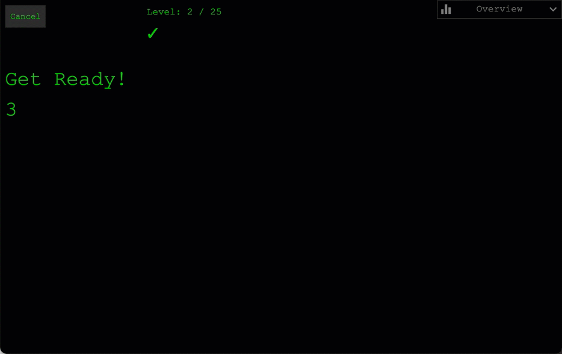

# Bitburner

Collection of scripts to solve Bitburner tasks.

### Note to other players

> This repo is public, to inspire you and to provide references for your own scripts.
> I've optimized scripts for best results on my machine and will not address issues of anyone else. In case you have a problem with one of the scripts, it's up to you to debug or improve the code.
>
> → **Finding creative solutions and writing your own scripts is the actual fun of the game** 😉

You are welcome to post feedback/ideas or share your own repo and scripts in the [Discussions](https://github.com/stracker-phil/bitburner/discussions/) section.

## Setup:

```
alias master="run master.js"

alias scan="run tools/scan.js"
alias find="run tools/find.js"
alias analyze="run tools/analyze.js"
alias contract="run tools/contract.js"
alias monitor="run tools/monitor.js;tail tools/monitor.js"
```

## Scripts

### `master`

Main entry point.

Usage: `master --help` or `master --info`

### `scan`

Greatly improved version of the original scan command. Requires about 20GB of RAM

Usage:
* `scan` .. list all servers
* `scan --hacked` .. only list hacked (rooted) servers
* `scan --own` .. only list own servers
* `scan --tree` .. display results as tree, instead of a list
* `scan WORD` .. display all servers with the given keyword in their name or organizations' name.

Screenshot:

<p align="center"></p>

### `find`

Locate a server based on a case-insensitive keyword.

Usage:
* `find WORD1 WORD2 WORDn` .. Locates all servers that contain WORD in their name or organization name.
* `find WORDS --tree` .. alternate output format
* `find WORDS --connect` .. [**NS4.1**] Displays connection string of the relevant server

Example:
* `find cse run` .. locates the CSEC and run4theh1llz servers
* `find I.I --tree` .. display path to the BlackHand server I.I.I.I
* `find csec --connect` .. quickly find the CSEC server (*requires NS4.1*)

Screenshot:

<p align="center"></p>

### `analyze`

Display details about a specific server

Usage:
* `analyze SERVER` .. output details about the specific server

Screenshot:

<p align="center"></p>

### `contract`

List or solve available contracts.

Usage:
* `contract`  .. list all available contracts
* `contract --solve` .. automatically solve all available contracts

Screenshot:

<p align="center"></p>

### `monitor`

Monitors the current attack target (the server that's targeted by `attk.js`)

Usage:
* `monitor` .. monitor the attk.js target
* `run tools/monitor.js n00dles; tail tools/monitor.js n00dles` .. monitor n00dles

Screenshot:

<p align="center"></p>

## Daemons

The following daemons are controlled by the `master` script.

### Server growth

The `grow.js` daemon automatically purchases new hacknet nodes and server upgrades as they become affordable.

Usage:
* `master --auto-grow on|off` .. Enable or disable the server growth mode
* `master --lock-money 10b` .. Locks $10b from grow.js budget
* `master --lock-money 0` .. Allows grow.js to use all available money

### Stock trading

The `stock.js` deamon is available after purchasing the TIX and 4S APIs. Starts automated stock trading. The script observes the stock market for a few minutes before placing first orders, and requires some time before showing first profits: During the first hour(s) the script seems to generate losses because it purchases many stock shares and holds them until prices reach an optimum. For best results, leave the script running for an entire day or overnight - but ensure that the game is running, as automated stock trading does not work when the game is closed!

Screenshot:

<p align="center"></p>

### Infiltration

The `master` script will spawn a daemon that automates company infiltration. That deamon uses browser-automation and does not rely on the NetScript API. It parses the screen contents and simulates the relevant keystrokes to solve infiltration games.

Once you enter the "Infiltrate" screen of any company, the deamon takes over and finishes all tasks that the company throws at us.

Usage:
* `master --auto-infiltrate on|off` .. Enable or disable the automated infiltration mode

Screenshot:

<p align="center"></p>